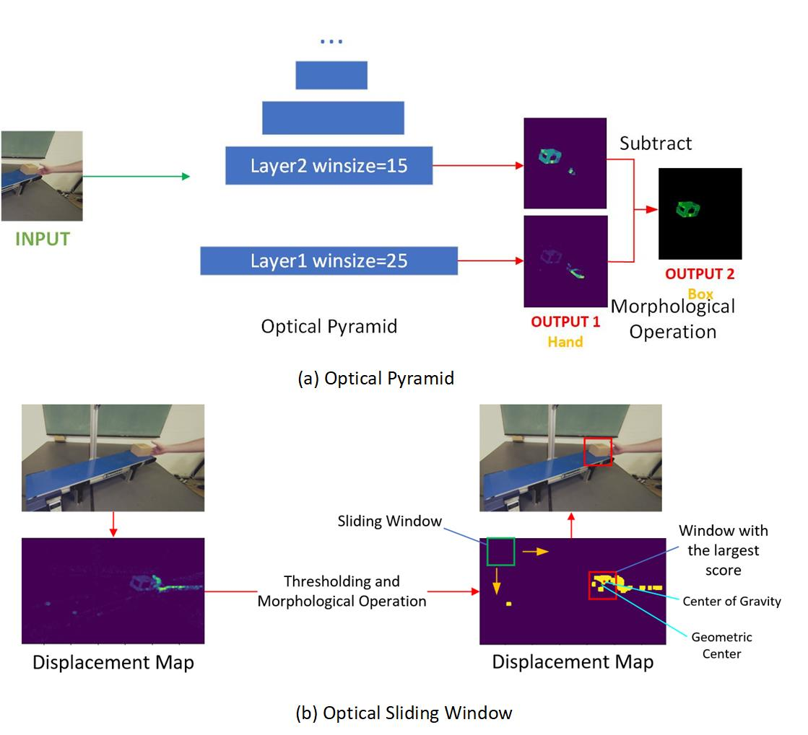

# Object-Trackers-based-on-Dense-Optical-Flow
## Dependency
- python == 3.7.4
- opencv == 3.4.2
- imutils == 0.5.3

## Assumptions
- Assumption1: If an object moves in a speed less than 1 pixel per frame, it could be considered static (sub-pixel moving is ignored).  
- Assumption2: The movement of the object is continuous from a spatial view. 
- Assumption3(optional): Since the object moves on a conveyor, its path is approximate a straight line.  

## Process

